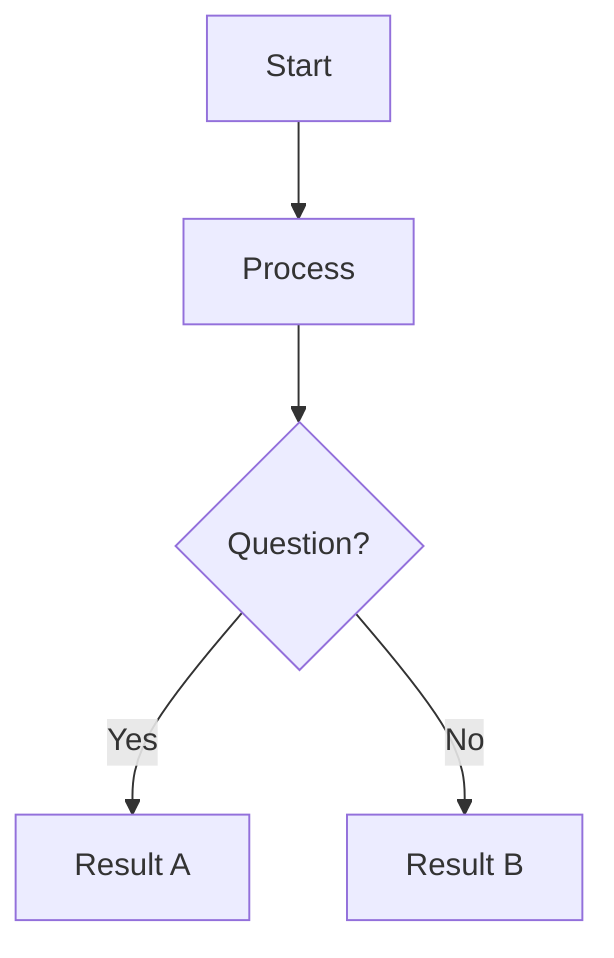
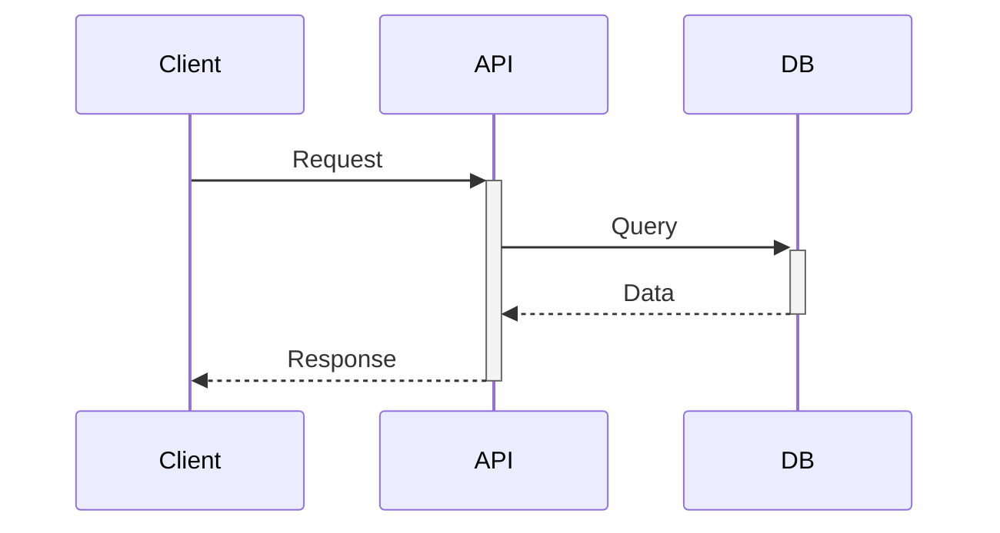
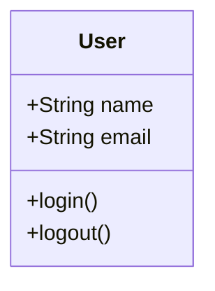
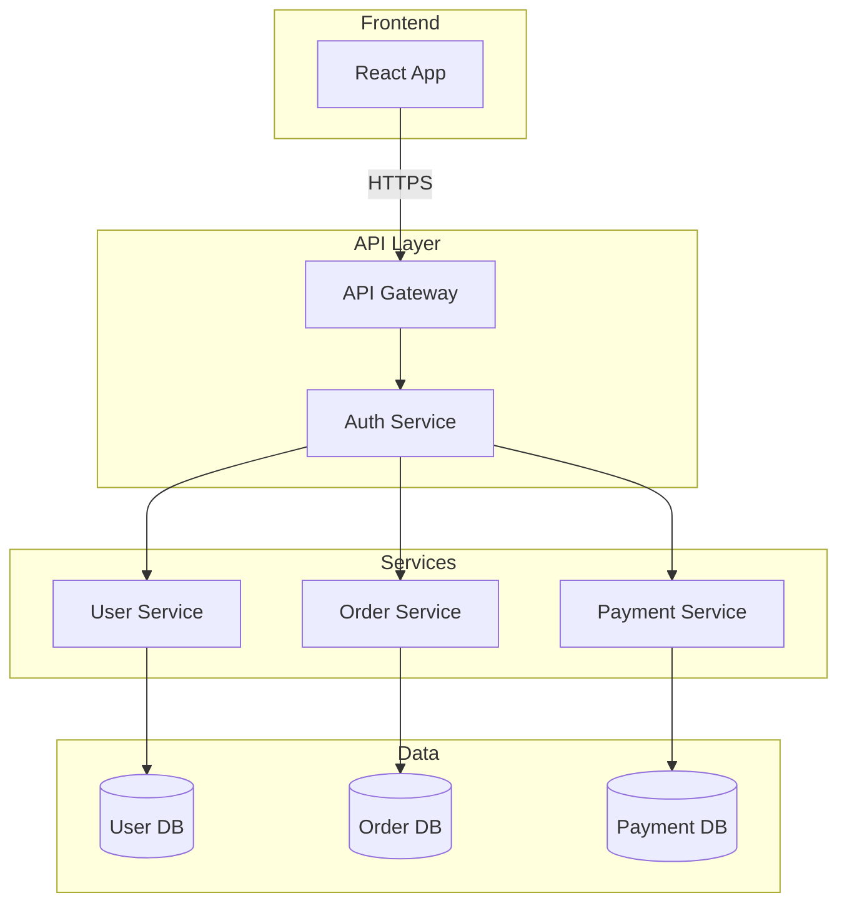

# TechnicalDiagram Workflow

Generate technical diagrams, architecture diagrams, and flowcharts.

## When to Use

- User asks for "diagram", "architecture diagram", "flowchart", "visualize system"
- Need to explain technical architecture
- Want visual representation of processes or systems

## Process

1. **Understand System**
   - What needs to be diagrammed?
   - Components/layers involved
   - Relationships and data flow
   - Level of detail needed

2. **Choose Format**
   - **Mermaid**: Text-based, version controllable, great for git
   - **Excalidraw**: Sketch-style, collaborative
   - **Nano Banana Pro**: High-quality rendered diagrams
   - **ASCII**: For terminal/minimal docs

3. **For Mermaid Diagrams**
   ```markdown
   \`\`\`mermaid
   graph TD
       A[Client] -->|HTTP Request| B[API Gateway]
       B --> C{Route?}
       C -->|/users| D[User Service]
       C -->|/orders| E[Order Service]
       D --> F[(Database)]
       E --> F
   \`\`\`
   ```

4. **For Nano Banana Pro Diagrams**
   - Load aesthetic
   - Create detailed prompt describing the system
   - Include: components, connections, labels, layout
   - Request clean technical illustration style
   - Generate via API

5. **Present Result**
   - Show diagram code (if Mermaid/Excalidraw)
   - Save image (if Nano Banana Pro)
   - Explain diagram components if needed

## Mermaid Diagram Types

**Flowchart:**


**Sequence Diagram:**


**Class Diagram:**


## Example: Architecture Diagram

**Input:** "Diagram my microservices architecture"

**Output (Mermaid):**


**Or via Nano Banana Pro:**
- Generate high-quality rendered diagram
- Apply technical aesthetic
- Include proper labels and connections
- Save as PNG with transparent background
