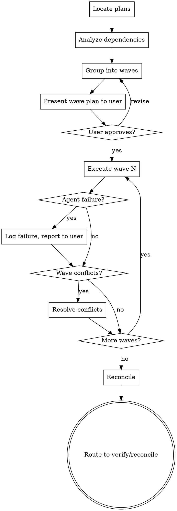

<objective>
Execute all plans in a phase using wave-based parallel dispatch.

Orchestrator stays lean: discover plans, analyze dependencies, group into waves, spawn agents per plan, collect results. Each agent gets fresh context with only its plan + relevant files.

Context budget: ~15% orchestrator, 100% fresh per agent.
</objective>

<context>
Phase: $ARGUMENTS

**Reference docs (load as needed):**
- Execution patterns: `references/phased-execution.md`
- State tracking: `references/state-tracking.md`
- Checkpoints: `references/checkpoints.md`
- Model routing: `references/model-routing.md`
</context>

<process>

<HARD-GATE>
Do NOT spawn any executor agents or begin implementation until you have:
1. Listed all plans and their dependency graph to the user
2. Shown the wave grouping (which plans run in parallel)
3. Received user confirmation to proceed
This applies to EVERY execution regardless of phase size.
</HARD-GATE>

## Process Flow

## Model Selection

Select agent model based on task complexity (see `references/model-selection-guidance.md`):

| Complexity Signal | Model | Examples |
|-------------------|-------|----------|
| 1-2 files, clear spec, mechanical | Sonnet | Rename, add validation, wire config |
| Multi-file, integration concerns | Sonnet or Opus | API + handler + tests coordination |
| Design judgment, broad codebase | Opus | Architecture changes, debugging |

**Never Haiku.** Minimum is Sonnet.

1. **Locate plans** -- Find all PLAN.md files in `.planning/phases/{phase}/`. Sort by filename (01-PLAN.md, 02-PLAN.md, etc.).

2. **Analyze dependencies** -- Read each plan's frontmatter for `depends_on` fields. Build dependency graph.

3. **Group into waves** -- Plans with no unmet dependencies go in Wave 1. Plans depending on Wave 1 go in Wave 2. Continue until all plans are assigned.

4. **Execute waves sequentially, plans within waves in parallel:**
   For each wave:
   a. For each plan in the wave, spawn an executor agent:
      - Agent reads: the PLAN.md, PROJECT.md (constraints), relevant source files listed in the plan
      - Agent executes tasks in order, commits atomically per task
      - Agent writes SUMMARY.md to the phase directory on completion
   b. Wait for all agents in the wave to complete
   c. Verify no conflicts between agent outputs (file ownership)
   d. If conflicts: resolve before proceeding to next wave

5. **Handle failures** -- If an agent fails:
   - Log the failure in STATE.md
   - If other plans in the wave are independent, let them continue
   - Report failure to user with diagnosis before proceeding

6. **Reconcile** -- After all waves complete:
   - Read `references/state-tracking.md`
   - Update STATE.md with completed plans, phase status
   - Compare planned vs actual (which tasks completed, which were skipped/added)

7. **Route** -- Suggest: "Run `/skippy:verify {phase}` to validate" or "Run `/skippy:reconcile` to compare plan vs actual"
</process>
