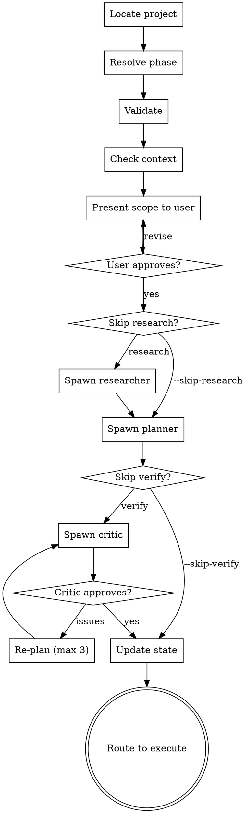

<objective>
Create executable phase plans (PLAN.md files) for a roadmap phase.

**Flow:** Research (optional) -> Plan -> Adversarial Review -> Done

Orchestrator stays lean: validate phase, optionally research, spawn planner agent, verify plan quality, iterate until pass or max 3 iterations.
</objective>

<context>
Phase number: $ARGUMENTS (auto-detects next unplanned phase if omitted)

**Flags:**
- `--skip-research` -- Skip research, go straight to planning
- `--skip-verify` -- Skip adversarial review loop

**Reference docs (load as needed, not all at once):**
- Plan format: `references/plan-structure.md`
- Scope protection: `references/plan-boundaries.md`
- State tracking: `references/state-tracking.md`
- Execution patterns: `references/phased-execution.md`
</context>

<process>

<HARD-GATE>
Do NOT spawn planner or researcher agents until you have:
1. Confirmed the target phase with the user
2. Shown any existing context (CONTEXT.md, prior plans)
3. Received user confirmation on scope and approach
This applies to EVERY planning run regardless of perceived clarity.
</HARD-GATE>

## Process Flow

1. **Locate project** -- Find `.planning/` in current directory or parents. Read STATE.md and ROADMAP.md.

2. **Resolve phase** -- If phase number provided, use it. Otherwise find next unplanned phase from ROADMAP.md.

3. **Validate** -- Confirm phase exists in ROADMAP.md, check for existing PLAN.md files, warn if re-planning.

4. **Check for context** -- If `.planning/phases/{phase}/CONTEXT.md` exists, read it for locked decisions and gray area resolutions.

5. **Research** (unless --skip-research) -- Read `skills/skippy/agents/researcher.md` for agent instructions. Spawn with:
   - Prompt: phase number, goal from ROADMAP.md, CONTEXT.md path if exists
   - Mode and model: read from agent frontmatter (see model routing below)
   - Wait for RESEARCH.md to be created in the phase directory

6. **Plan** -- Read `skills/skippy/agents/planner.md` for agent instructions. Spawn with:
   - Prompt: phase number, ROADMAP.md phase section, RESEARCH.md path, CONTEXT.md path if exists
   - Mode and model: read from agent frontmatter (see model routing below)
   - Wait for PLAN.md files to be created in the phase directory

7. **Verify** (unless --skip-verify) -- Read `skills/skippy/agents/critic.md` for agent instructions. Spawn with:
   - Prompt: phase number, ROADMAP.md phase section, paths to all PLAN.md files
   - Mode and model: read from agent frontmatter (see model routing below)
   - If issues found: report to orchestrator, re-spawn planner with critic feedback, re-verify (max 3 iterations)

8. **Update state** -- Update STATE.md with new phase status. Report plan count and next step.

9. **Route** -- Suggest: "Run `/skippy:execute {phase}` to execute" or flag blockers.

## Model Routing

Agent definitions use `complexity:` (not `model:`) in frontmatter. Map at spawn time:

| complexity | Model parameter | Rationale |
|------------|----------------|-----------|
| HIGH | opus | Deep reasoning, tradeoff analysis |
| MEDIUM | sonnet | Standard implementation work |
| LOW | sonnet | Mechanical lookups, simple edits |

If no `complexity:` field, default to MEDIUM. See `references/model-routing.md` for full decision rules.
</process>
