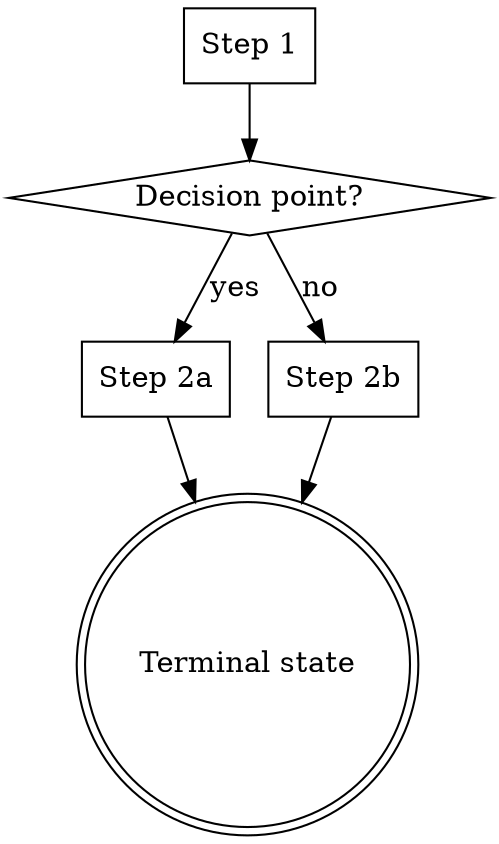

# Graphviz Dot Process Flows in Skills

**Source:** superpowers (obra/superpowers) -- all 14 skills use this pattern
**Cherry-picked:** 2026-03-17

## Concept

Embed Graphviz `dot` notation process flows directly in skill SKILL.md files. These serve dual purpose:

1. **Human documentation** -- rendered as diagrams in any Markdown viewer that supports Mermaid/Graphviz
2. **Agent-parseable structure** -- LLMs read dot notation well and can follow the decision tree

## Syntax

````markdown

````

## Shape Conventions

| Shape | Meaning |
|-------|---------|
| `box` | Action step |
| `diamond` | Decision point |
| `doublecircle` | Terminal state (skill exit) |
| `ellipse` | Loop/continuation point |

## When to Use

- Skills with branching logic (if X then Y else Z)
- Multi-step workflows where ordering matters
- Decision trees for "when to use this skill vs another"
- Review/approval loops with retry paths

## When NOT to Use

- Simple linear skills (just use a numbered list)
- Skills where the process is obvious from the prose
- Very complex flows (dot becomes unreadable past ~15 nodes -- split into sub-diagrams)

## PAI Application

Consider adding dot diagrams to:
- `/skippy:execute` -- wave dispatch with pre-checks and validation gates
- `/skippy:plan` -- research → plan → adversarial review → finalize flow
- `/skippy:review` -- swarm dispatch → collect → apply fixes → verify loop
- `/deploy-service` -- multi-step infrastructure provisioning

Keep prose descriptions alongside the diagrams -- the dot is supplementary structure, not a replacement for clear written instructions.
